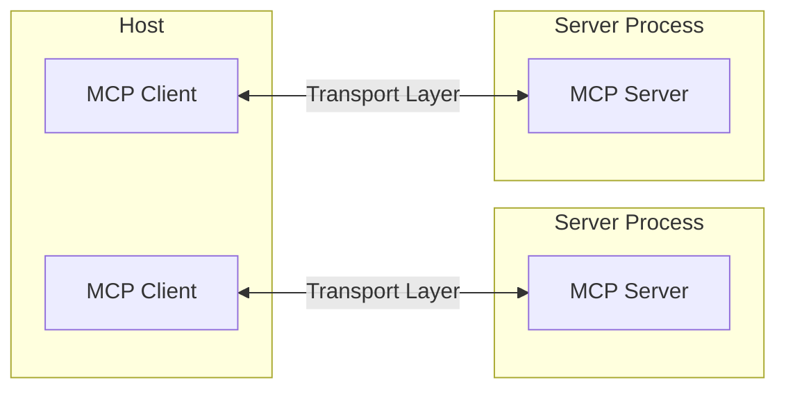
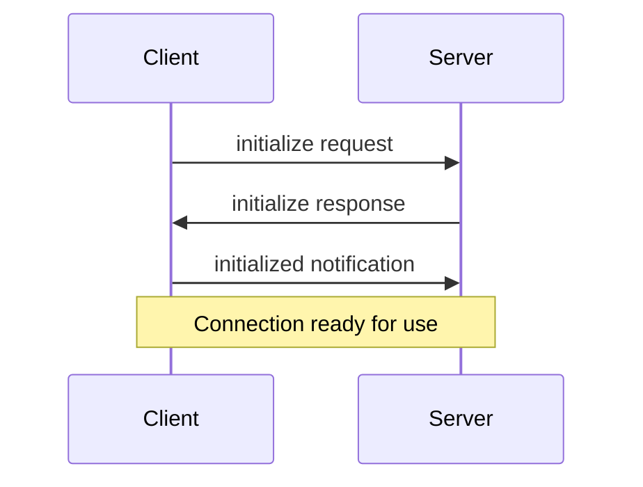

Overview
The Model Context Protocol allows applications to provide context for LLMs in a standardized way, separating the concerns of providing context from the actual LLM interaction. This TypeScript SDK implements the full MCP specification, making it easy to:

Build MCP clients that can connect to any MCP server
Create MCP servers that expose resources, prompts and tools
Use standard transports like stdio and SSE
Handle all MCP protocol messages and lifecycle events
Installation
npm install @modelcontextprotocol/sdk
Quick Start
Let's create a simple MCP server that exposes a calculator tool and some data:

import { McpServer, ResourceTemplate } from "@modelcontextprotocol/sdk/server/mcp.js";
import { StdioServerTransport } from "@modelcontextprotocol/sdk/server/stdio.js";
import { z } from "zod";

// Create an MCP server
const server = new McpServer({
  name: "Demo",
  version: "1.0.0"
});

// Add an addition tool
server.tool("add",
  { a: z.number(), b: z.number() },
  async ({ a, b }) => ({
    content: [{ type: "text", text: String(a + b) }]
  })
);

// Add a dynamic greeting resource
server.resource(
  "greeting",
  new ResourceTemplate("greeting://{name}", { list: undefined }),
  async (uri, { name }) => ({
    contents: [{
      uri: uri.href,
      text: `Hello, ${name}!`
    }]
  })
);

// Start receiving messages on stdin and sending messages on stdout
const transport = new StdioServerTransport();
await server.connect(transport);

**What is MCP?**
The Model Context Protocol (MCP) lets you build servers that expose data and functionality to LLM applications in a secure, standardized way. 
Think of it like a web API, but specifically designed for LLM interactions. MCP servers can:

Expose data through Resources (think of these sort of like GET endpoints; they are used to load information into the LLM's context)
Provide functionality through Tools (sort of like POST endpoints; they are used to execute code or otherwise produce a side effect)
Define interaction patterns through Prompts (reusable templates for LLM interactions)
And more!
Core Concepts
Server
The McpServer is your core interface to the MCP protocol. It handles connection management, protocol compliance, and message routing:

const server = new McpServer({
  name: "My App",
  version: "1.0.0"
});
Resources
Resources are how you expose data to LLMs. They're similar to GET endpoints in a REST API - they provide data but shouldn't perform significant computation or have side effects:

// Static resource
server.resource(
  "config",
  "config://app",
  async (uri) => ({
    contents: [{
      uri: uri.href,
      text: "App configuration here"
    }]
  })
);

// Dynamic resource with parameters
server.resource(
  "user-profile",
  new ResourceTemplate("users://{userId}/profile", { list: undefined }),
  async (uri, { userId }) => ({
    contents: [{
      uri: uri.href,
      text: `Profile data for user ${userId}`
    }]
  })
);
Tools
Tools let LLMs take actions through your server. Unlike resources, tools are expected to perform computation and have side effects:

// Simple tool with parameters
server.tool(
  "calculate-bmi",
  {
    weightKg: z.number(),
    heightM: z.number()
  },
  async ({ weightKg, heightM }) => ({
    content: [{
      type: "text",
      text: String(weightKg / (heightM * heightM))
    }]
  })
);

// Async tool with external API call
server.tool(
  "fetch-weather",
  { city: z.string() },
  async ({ city }) => {
    const response = await fetch(`https://api.weather.com/${city}`);
    const data = await response.text();
    return {
      content: [{ type: "text", text: data }]
    };
  }
);
Prompts
Prompts are reusable templates that help LLMs interact with your server effectively:

server.prompt(
  "review-code",
  { code: z.string() },
  ({ code }) => ({
    messages: [{
      role: "user",
      content: {
        type: "text",
        text: `Please review this code:\n\n${code}`
      }
    }]
  })
);
Running Your Server
MCP servers in TypeScript need to be connected to a transport to communicate with clients. How you start the server depends on the choice of transport:

stdio
For command-line tools and direct integrations:

import { McpServer } from "@modelcontextprotocol/sdk/server/mcp.js";
import { StdioServerTransport } from "@modelcontextprotocol/sdk/server/stdio.js";

const server = new McpServer({
  name: "example-server",
  version: "1.0.0"
});

// ... set up server resources, tools, and prompts ...

const transport = new StdioServerTransport();
await server.connect(transport);
HTTP with SSE
For remote servers, start a web server with a Server-Sent Events (SSE) endpoint, and a separate endpoint for the client to send its messages to:

import express, { Request, Response } from "express";
import { McpServer } from "@modelcontextprotocol/sdk/server/mcp.js";
import { SSEServerTransport } from "@modelcontextprotocol/sdk/server/sse.js";

const server = new McpServer({
  name: "example-server",
  version: "1.0.0"
});

// ... set up server resources, tools, and prompts ...

const app = express();

// to support multiple simultaneous connections we have a lookup object from
// sessionId to transport
const transports: {[sessionId: string]: SSEServerTransport} = {};

app.get("/sse", async (_: Request, res: Response) => {
  const transport = new SSEServerTransport('/messages', res);
  transports[transport.sessionId] = transport;
  res.on("close", () => {
    delete transports[transport.sessionId];
  });
  await server.connect(transport);
});

app.post("/messages", async (req: Request, res: Response) => {
  const sessionId = req.query.sessionId as string;
  const transport = transports[sessionId];
  if (transport) {
    await transport.handlePostMessage(req, res);
  } else {
    res.status(400).send('No transport found for sessionId');
  }
});

app.listen(3001);
Testing and Debugging
To test your server, you can use the MCP Inspector. See its README for more information.

Examples
Echo Server
A simple server demonstrating resources, tools, and prompts:

import { McpServer, ResourceTemplate } from "@modelcontextprotocol/sdk/server/mcp.js";
import { z } from "zod";

const server = new McpServer({
  name: "Echo",
  version: "1.0.0"
});

server.resource(
  "echo",
  new ResourceTemplate("echo://{message}", { list: undefined }),
  async (uri, { message }) => ({
    contents: [{
      uri: uri.href,
      text: `Resource echo: ${message}`
    }]
  })
);

server.tool(
  "echo",
  { message: z.string() },
  async ({ message }) => ({
    content: [{ type: "text", text: `Tool echo: ${message}` }]
  })
);

server.prompt(
  "echo",
  { message: z.string() },
  ({ message }) => ({
    messages: [{
      role: "user",
      content: {
        type: "text",
        text: `Please process this message: ${message}`
      }
    }]
  })
);
SQLite Explorer
A more complex example showing database integration:

import { McpServer } from "@modelcontextprotocol/sdk/server/mcp.js";
import sqlite3 from "sqlite3";
import { promisify } from "util";
import { z } from "zod";

const server = new McpServer({
  name: "SQLite Explorer",
  version: "1.0.0"
});

// Helper to create DB connection
const getDb = () => {
  const db = new sqlite3.Database("database.db");
  return {
    all: promisify<string, any[]>(db.all.bind(db)),
    close: promisify(db.close.bind(db))
  };
};

server.resource(
  "schema",
  "schema://main",
  async (uri) => {
    const db = getDb();
    try {
      const tables = await db.all(
        "SELECT sql FROM sqlite_master WHERE type='table'"
      );
      return {
        contents: [{
          uri: uri.href,
          text: tables.map((t: {sql: string}) => t.sql).join("\n")
        }]
      };
    } finally {
      await db.close();
    }
  }
);

server.tool(
  "query",
  { sql: z.string() },
  async ({ sql }) => {
    const db = getDb();
    try {
      const results = await db.all(sql);
      return {
        content: [{
          type: "text",
          text: JSON.stringify(results, null, 2)
        }]
      };
    } catch (err: unknown) {
      const error = err as Error;
      return {
        content: [{
          type: "text",
          text: `Error: ${error.message}`
        }],
        isError: true
      };
    } finally {
      await db.close();
    }
  }
);
Advanced Usage
Dynamic Servers
If you want to offer an initial set of tools/prompts/resources, but later add additional ones based on user action or external state change, you can add/update/remove them after the Server is connected. This will automatically emit the corresponding listChanged notificaions:

import { McpServer } from "@modelcontextprotocol/sdk/server/mcp.js";
import { z } from "zod";

const server = new McpServer({
  name: "Dynamic Example",
  version: "1.0.0"
});

const listMessageTool = server.tool(
  "listMessages",
  { channel: z.string() },
  async ({ channel }) => ({
    content: [{ type: "text", text: await listMessages(channel) }]
  })
);

const putMessageTool = server.tool(
  "putMessage",
  { channel: z.string(), message: z.string() },
  async ({ channel, message }) => ({
    content: [{ type: "text", text: await putMessage(channel, string) }]
  })
);
// Until we upgrade auth, `putMessage` is disabled (won't show up in listTools)
putMessageTool.disable()

const upgradeAuthTool = server.tool(
  "upgradeAuth",
  { permission: z.enum(["write', vadmin"])},
  // Any mutations here will automatically emit `listChanged` notifications
  async ({ permission }) => {
    const { ok, err, previous } = await upgradeAuthAndStoreToken(permission)
    if (!ok) return {content: [{ type: "text", text: `Error: ${err}` }]}

    // If we previously had read-only access, 'putMessage' is now available
    if (previous === "read") {
      putMessageTool.enable()
    }

    if (permission === 'write') {
      // If we've just upgraded to 'write' permissions, we can still call 'upgradeAuth' 
      // but can only upgrade to 'admin'. 
      upgradeAuthTool.update({
        paramSchema: { permission: z.enum(["admin"]) }, // change validation rules
      })
    } else {
      // If we're now an admin, we no longer have anywhere to upgrade to, so fully remove that tool
      upgradeAuthTool.remove()
    }
  }
)

// Connect as normal
const transport = new StdioServerTransport();
await server.connect(transport);
Low-Level Server
For more control, you can use the low-level Server class directly:

import { Server } from "@modelcontextprotocol/sdk/server/index.js";
import { StdioServerTransport } from "@modelcontextprotocol/sdk/server/stdio.js";
import {
  ListPromptsRequestSchema,
  GetPromptRequestSchema
} from "@modelcontextprotocol/sdk/types.js";

const server = new Server(
  {
    name: "example-server",
    version: "1.0.0"
  },
  {
    capabilities: {
      prompts: {}
    }
  }
);

server.setRequestHandler(ListPromptsRequestSchema, async () => {
  return {
    prompts: [{
      name: "example-prompt",
      description: "An example prompt template",
      arguments: [{
        name: "arg1",
        description: "Example argument",
        required: true
      }]
    }]
  };
});

server.setRequestHandler(GetPromptRequestSchema, async (request) => {
  if (request.params.name !== "example-prompt") {
    throw new Error("Unknown prompt");
  }
  return {
    description: "Example prompt",
    messages: [{
      role: "user",
      content: {
        type: "text",
        text: "Example prompt text"
      }
    }]
  };
});

const transport = new StdioServerTransport();
await server.connect(transport);
Writing MCP Clients
The SDK provides a high-level client interface:

import { Client } from "@modelcontextprotocol/sdk/client/index.js";
import { StdioClientTransport } from "@modelcontextprotocol/sdk/client/stdio.js";

const transport = new StdioClientTransport({
  command: "node",
  args: ["server.js"]
});

const client = new Client(
  {
    name: "example-client",
    version: "1.0.0"
  }
);

await client.connect(transport);

// List prompts
const prompts = await client.listPrompts();

// Get a prompt
const prompt = await client.getPrompt({
  name: "example-prompt",
  arguments: {
    arg1: "value"
  }
});

// List resources
const resources = await client.listResources();

// Read a resource
const resource = await client.readResource({
  uri: "file:///example.txt"
});

// Call a tool
const result = await client.callTool({
  name: "example-tool",
  arguments: {
    arg1: "value"
  }
});
Proxy Authorization Requests Upstream
You can proxy OAuth requests to an external authorization provider:

import express from 'express';
import { ProxyOAuthServerProvider, mcpAuthRouter } from '@modelcontextprotocol/sdk';

const app = express();

const proxyProvider = new ProxyOAuthServerProvider({
    endpoints: {
        authorizationUrl: "https://auth.external.com/oauth2/v1/authorize",
        tokenUrl: "https://auth.external.com/oauth2/v1/token",
        revocationUrl: "https://auth.external.com/oauth2/v1/revoke",
    },
    verifyAccessToken: async (token) => {
        return {
            token,
            clientId: "123",
            scopes: ["openid", "email", "profile"],
        }
    },
    getClient: async (client_id) => {
        return {
            client_id,
            redirect_uris: ["http://localhost:3000/callback"],
        }
    }
})

app.use(mcpAuthRouter({
    provider: proxyProvider,
    issuerUrl: new URL("http://auth.external.com"),
    baseUrl: new URL("http://mcp.example.com"),
    serviceDocumentationUrl: new URL("https://docs.example.com/"),
}))
This setup allows you to:

Forward OAuth requests to an external provider
Add custom token validation logic
Manage client registrations
Provide custom documentation URLs
Maintain control over the OAuth flow while delegating to an external provider
Documentation
Model Context Protocol documentation
MCP Specification
Example Servers
# Core architecture

> Understand how MCP connects clients, servers, and LLMs

The Model Context Protocol (MCP) is built on a flexible, extensible architecture that enables seamless communication between LLM applications and integrations. This document covers the core architectural components and concepts.

## Overview

MCP follows a client-server architecture where:

* **Hosts** are LLM applications (like Claude Desktop or IDEs) that initiate connections
* **Clients** maintain 1:1 connections with servers, inside the host application
* **Servers** provide context, tools, and prompts to clients



## Core components

### Protocol layer

The protocol layer handles message framing, request/response linking, and high-level communication patterns.

<Tabs>
  <Tab title="TypeScript">
    ```typescript
    class Protocol<Request, Notification, Result> {
        // Handle incoming requests
        setRequestHandler<T>(schema: T, handler: (request: T, extra: RequestHandlerExtra) => Promise<Result>): void

        // Handle incoming notifications
        setNotificationHandler<T>(schema: T, handler: (notification: T) => Promise<void>): void

        // Send requests and await responses
        request<T>(request: Request, schema: T, options?: RequestOptions): Promise<T>

        // Send one-way notifications
        notification(notification: Notification): Promise<void>
    }
    ```
  </Tab>

  <Tab title="Python">
    ```python
    class Session(BaseSession[RequestT, NotificationT, ResultT]):
        async def send_request(
            self,
            request: RequestT,
            result_type: type[Result]
        ) -> Result:
            """Send request and wait for response. Raises McpError if response contains error."""
            # Request handling implementation

        async def send_notification(
            self,
            notification: NotificationT
        ) -> None:
            """Send one-way notification that doesn't expect response."""
            # Notification handling implementation

        async def _received_request(
            self,
            responder: RequestResponder[ReceiveRequestT, ResultT]
        ) -> None:
            """Handle incoming request from other side."""
            # Request handling implementation

        async def _received_notification(
            self,
            notification: ReceiveNotificationT
        ) -> None:
            """Handle incoming notification from other side."""
            # Notification handling implementation
    ```
  </Tab>
</Tabs>

Key classes include:

* `Protocol`
* `Client`
* `Server`

### Transport layer

The transport layer handles the actual communication between clients and servers. MCP supports multiple transport mechanisms:

1. **Stdio transport**
   * Uses standard input/output for communication
   * Ideal for local processes

2. **HTTP with SSE transport**
   * Uses Server-Sent Events for server-to-client messages
   * HTTP POST for client-to-server messages

All transports use [JSON-RPC](https://www.jsonrpc.org/) 2.0 to exchange messages. See the [specification](/specification/) for detailed information about the Model Context Protocol message format.

### Message types

MCP has these main types of messages:

1. **Requests** expect a response from the other side:
   ```typescript
   interface Request {
     method: string;
     params?: { ... };
   }
   ```

2. **Results** are successful responses to requests:
   ```typescript
   interface Result {
     [key: string]: unknown;
   }
   ```

3. **Errors** indicate that a request failed:
   ```typescript
   interface Error {
     code: number;
     message: string;
     data?: unknown;
   }
   ```

4. **Notifications** are one-way messages that don't expect a response:
   ```typescript
   interface Notification {
     method: string;
     params?: { ... };
   }
   ```

## Connection lifecycle

### 1. Initialization



1. Client sends `initialize` request with protocol version and capabilities
2. Server responds with its protocol version and capabilities
3. Client sends `initialized` notification as acknowledgment
4. Normal message exchange begins

### 2. Message exchange

After initialization, the following patterns are supported:

* **Request-Response**: Client or server sends requests, the other responds
* **Notifications**: Either party sends one-way messages

### 3. Termination

Either party can terminate the connection:

* Clean shutdown via `close()`
* Transport disconnection
* Error conditions

## Error handling

MCP defines these standard error codes:

```typescript
enum ErrorCode {
  // Standard JSON-RPC error codes
  ParseError = -32700,
  InvalidRequest = -32600,
  MethodNotFound = -32601,
  InvalidParams = -32602,
  InternalError = -32603
}
```

SDKs and applications can define their own error codes above -32000.

Errors are propagated through:

* Error responses to requests
* Error events on transports
* Protocol-level error handlers

## Implementation example

Here's a basic example of implementing an MCP server:

<Tabs>
  <Tab title="TypeScript">
    ```typescript
    import { Server } from "@modelcontextprotocol/sdk/server/index.js";
    import { StdioServerTransport } from "@modelcontextprotocol/sdk/server/stdio.js";

    const server = new Server({
      name: "example-server",
      version: "1.0.0"
    }, {
      capabilities: {
        resources: {}
      }
    });

    // Handle requests
    server.setRequestHandler(ListResourcesRequestSchema, async () => {
      return {
        resources: [
          {
            uri: "example://resource",
            name: "Example Resource"
          }
        ]
      };
    });

    // Connect transport
    const transport = new StdioServerTransport();
    await server.connect(transport);
    ```
  </Tab>

  <Tab title="Python">
    ```python
    import asyncio
    import mcp.types as types
    from mcp.server import Server
    from mcp.server.stdio import stdio_server

    app = Server("example-server")

    @app.list_resources()
    async def list_resources() -> list[types.Resource]:
        return [
            types.Resource(
                uri="example://resource",
                name="Example Resource"
            )
        ]

    async def main():
        async with stdio_server() as streams:
            await app.run(
                streams[0],
                streams[1],
                app.create_initialization_options()
            )

    if __name__ == "__main__":
        asyncio.run(main())
    ```
  </Tab>
</Tabs>

## Best practices

### Transport selection

1. **Local communication**
   * Use stdio transport for local processes
   * Efficient for same-machine communication
   * Simple process management

2. **Remote communication**
   * Use SSE for scenarios requiring HTTP compatibility
   * Consider security implications including authentication and authorization

### Message handling

1. **Request processing**
   * Validate inputs thoroughly
   * Use type-safe schemas
   * Handle errors gracefully
   * Implement timeouts

2. **Progress reporting**
   * Use progress tokens for long operations
   * Report progress incrementally
   * Include total progress when known

3. **Error management**
   * Use appropriate error codes
   * Include helpful error messages
   * Clean up resources on errors

## Security considerations

1. **Transport security**
   * Use TLS for remote connections
   * Validate connection origins
   * Implement authentication when needed

2. **Message validation**
   * Validate all incoming messages
   * Sanitize inputs
   * Check message size limits
   * Verify JSON-RPC format

3. **Resource protection**
   * Implement access controls
   * Validate resource paths
   * Monitor resource usage
   * Rate limit requests

4. **Error handling**
   * Don't leak sensitive information
   * Log security-relevant errors
   * Implement proper cleanup
   * Handle DoS scenarios

## Debugging and monitoring

1. **Logging**
   * Log protocol events
   * Track message flow
   * Monitor performance
   * Record errors

2. **Diagnostics**
   * Implement health checks
   * Monitor connection state
   * Track resource usage
   * Profile performance

3. **Testing**
   * Test different transports
   * Verify error handling
   * Check edge cases
   * Load test servers
